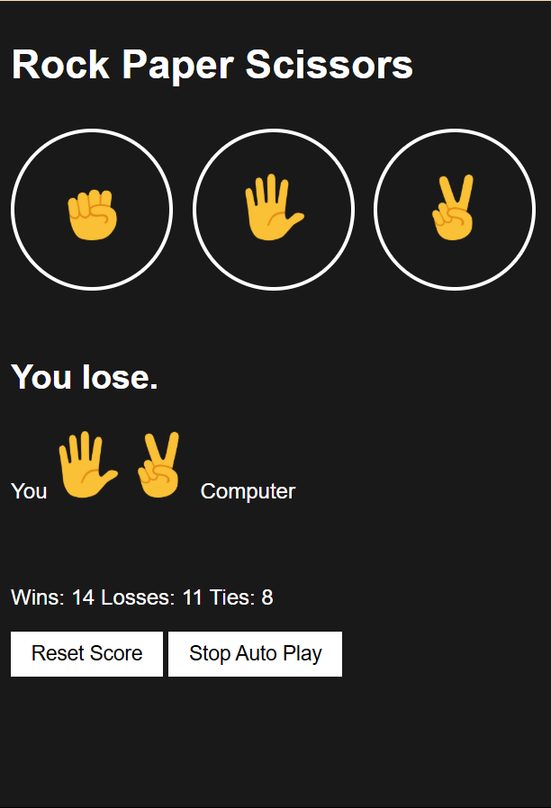
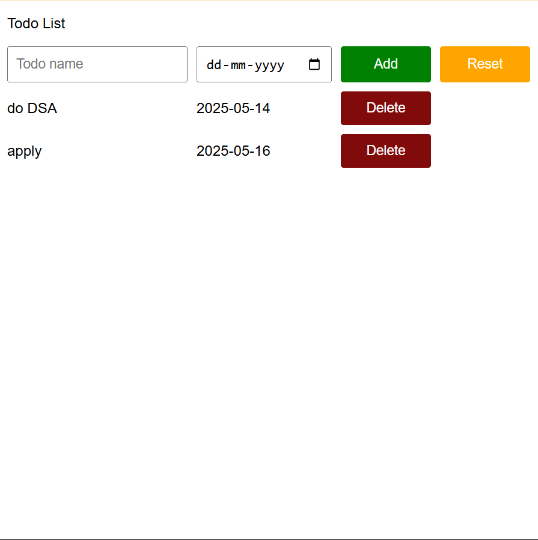

# 🎯 JavaScript Mini Projects

This repository contains two mini-projects built with **HTML, CSS, and JavaScript** to understand JS fundamentals in depth.

---

## 📁 Projects Overview

### 1. 🪨 Rock-Paper-Scissors Game

An interactive game with live score tracking, auto-play, and persistent storage.

#### ✅ Features
- Live game score tracking
- LocalStorage for score persistence
- Clean and responsive UI
- Auto-play mode with random choices

#### 🔜 Upcoming Features
- 🎵 Sound effects on play
- 👥 Two-player support (local)
- 🌙 Light/Dark theme toggle

#### ▶️ How to Run
- Open `12-rock_paper_scisors.html` in your browser
- Or, use **"Go Live"** feature if using VSCode with Live Server extension

---

### 2. 📝 To-Do List App

A simple, elegant to-do list for task tracking.

#### ✅ Features
- Add task with description and date
- Remove individual tasks
- Reset all tasks
- Data is saved using LocalStorage

#### 🔜 Upcoming Features
- 🌙 Dark theme
- 🤝 Collaborative list (real-time sync)
- 🖼️ Add images to tasks
- 🎨 Improved UI with animations

#### ▶️ How to Run
- Open `12-todo_list.html` in your browser
- Or, use **"Go Live"** via Live Server

---

## 🛠️ Tech Stack

- HTML5
- CSS3
- Vanilla JavaScript (ES6+)
- LocalStorage API

---

## 📸 Screenshots

> *(Add images in a folder like `/images` and reference here)*

| Rock-Paper-Scissors | To-Do List |
|---------------------|------------|
|  |  |

---

## 🤝 Contributing

Feel free to fork the repository and submit pull requests with enhancements, bug fixes, or new features.

---

## 💡 Author

**Aryan Kapoor** — [GitHub](https://github.com/meowkapoor)

---

